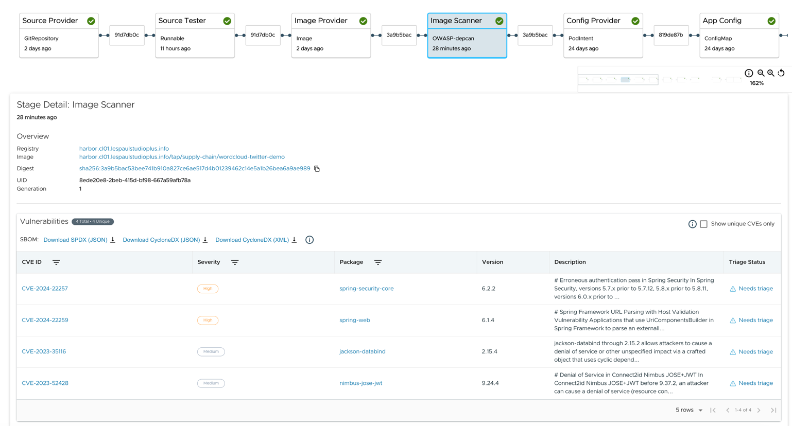

# TAP SCAN 2.0 with OWASP depscan

An example of using [OWASP depscan](https://github.com/owasp-dep-scan/dep-scan) for [Bring your own scanner using an ImageVulnerabilityScan](https://docs.vmware.com/en/VMware-Tanzu-Application-Platform/1.8/tap/scst-scan-ivs-create-your-own.html) for Tanzu Application Platform

[!WARNING]
This is build only for demo purpose not designed for any production use case. The author will not be responsible for any outages

## Sample Result

